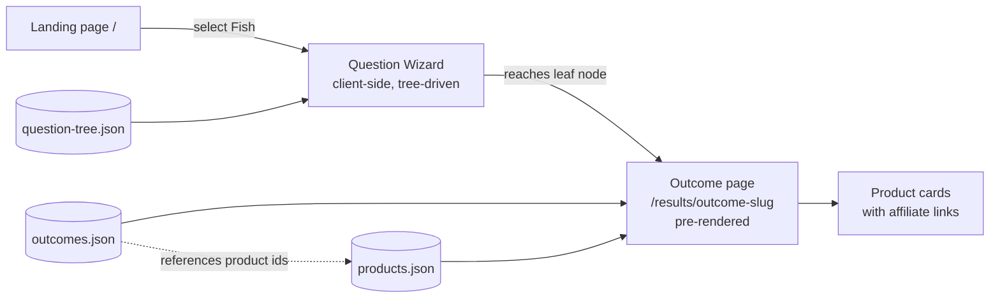

# Design: Aquarium Health Helper (v1 — Fish path)

Based on [requirements](requirements — see brainstorm output) and [research_aquarium_helper_competitors_users_20260910.md](research_aquarium_helper_competitors_users_20260910.md).

Scope: architecture, data model, page/component structure. No implementation code (that's `/sc:sc:implement`).

---

## 1. Architecture style

**Static-generated site, content-as-data, no backend/database for v1.**

Why this fits (not a default — it's driven by the actual requirements):
- No user accounts, no saved history → nothing that needs a live backend or auth.
- "SEO-ready clean URLs" + "fast load" → static pre-rendered pages beat a client-rendered SPA.
- "Admin can update product mappings without touching question logic" → satisfied by separating the question tree and the product catalog into two data files, not by building an admin panel/CMS. A single maintainer editing JSON in git is simpler than standing up a database + admin UI for what is, at v1 scale, a few dozen records.
- Only the question-wizard screen needs interactivity; everything else (landing page, outcome/result pages) can be fully static.



Skipped: database, CMS, admin dashboard, user auth. Add a database only if/when content volume or multi-author editing outgrows git-managed JSON (see Open Items).

---

## 2. Data model

Three flat JSON files, each independently editable:

### `question-tree.json`
```json
{
  "start": "fish-entry",
  "nodes": {
    "fish-entry": {
      "text": "What are you noticing?",
      "type": "single-choice",
      "options": [
        { "label": "Spots, sores, or visible growths", "next": "illness-visible" },
        { "label": "Acting strangely (hiding, not eating, gasping)", "next": "behavior-root" },
        { "label": "My fish died or is actively dying", "next": "death-root" },
        { "label": "Just set up / stocking questions", "next": "newtank-root" }
      ]
    },
    "illness-visible": {
      "text": "Where on the fish is it?",
      "type": "single-choice",
      "options": [
        { "label": "White spots like grains of salt", "next": "outcome:ich" },
        { "label": "Ragged or disappearing fins", "next": "outcome:fin-rot" }
      ]
    }
  }
}
```
- Node types: `single-choice` or `yes-no` (yes-no is just single-choice with two fixed options).
- An option's `next` is either another node id, or `outcome:<slug>` — a leaf.
- Every node is reachable from `start` by walking `options[].next`; validate this at build time (no orphaned or dangling nodes) — see the self-check in §5.

### `outcomes.json`
```json
{
  "ich": {
    "title": "Ich (White Spot Disease)",
    "explanation": "Small white spots resembling salt grains, often with fish rubbing against decor.",
    "confidence": "likely",
    "productIds": ["ich-treatment-generic", "aquarium-salt", "quarantine-net-breeder"]
  }
}
```
- Keyed by the same slug used in `outcome:<slug>`.
- `productIds` is an ordered list of references into `products.json` — this is the layer a non-developer edits to change recommendations.
- Supports the "ranked possible causes" case from research: an outcome can itself be a ranked list — represent that as multiple outcome entries reachable from one node, each with a `confidence` field (`likely` / `possible`), rendered together on one result page when more than one is relevant.

### `products.json`
```json
{
  "ich-treatment-generic": {
    "name": "API Super Ick Cure",
    "amazonAffiliateUrl": "https://www.amazon.com/dp/XXXXX?tag=YOURTAG-20",
    "imageUrl": "/images/products/api-super-ick-cure.jpg",
    "note": "Common first-line ich treatment"
  }
}
```
- One record per physical product, reused across as many outcomes as relevant.
- Central place to update a dead/changed Amazon link — matches requirement #7 directly.

---

## 3. Page / route structure

| Route | Rendering | Purpose |
|---|---|---|
| `/` | Static | Landing — choose Fish / Water (disabled) / Plants (disabled) |
| `/diagnose/fish` | Static shell + client-side wizard | Walks `question-tree.json` from `start`, one question per screen, back button |
| `/results/[slug]` | Static, pre-rendered at build time from `outcomes.json` | Shows explanation + product cards + affiliate disclosure; directly linkable/shareable and indexable by search engines |
| `/disclosure` | Static | FTC affiliate disclosure, linked from every result page |

Pre-rendering every outcome as its own static route (rather than only reaching it via the wizard) is what makes the SEO-readiness requirement real — these pages can later be linked into from blog content or rank on their own for "ich treatment" type queries, without extra work.

---

## 4. Component design

- **`QuestionWizard`** — generic, takes a tree JSON + a `start` node id as props. Not fish-specific: this is what lets Water/Plants reuse the same component later by pointing it at a different tree file.
  - State: current node id, answer history (for the back button).
  - On reaching an `outcome:` reference, navigates to `/results/[slug]`.
- **`ResultPage`** — takes one or more outcome records, renders explanation + list of `ProductCard`.
- **`ProductCard`** — image, name, one-line note, affiliate link (`rel="sponsored noopener"`, opens in new tab), inline "as an Amazon Associate..." disclosure snippet.
- **`AnswerButton`** — single/yes-no option button, shared by all question types.

No component needs server-side logic — all read static JSON at build time or bundle time.

---

## 5. Non-functional / validation notes

- **Tree integrity self-check**: a small build-time script (or test) that walks `question-tree.json` from `start` and asserts (a) every `next` target exists, either as a node id or as an `outcome:` slug present in `outcomes.json`, and (b) every `productIds` entry exists in `products.json`. This is the "one runnable check" for the non-trivial branching logic — cheap to write, catches broken content edits before they ship dead links or dangling questions.
- **Mobile-first**: wizard and result cards are single-column by default; no layout that assumes desktop width.
- **Affiliate disclosure**: rendered on every result page, not just a buried policy page (Amazon Associates requirement).

---

## Open Items (deferred, not decided here)
- Concrete framework choice (Astro vs. Next.js static export vs. plain static HTML+JS) — any satisfies this design; pick based on what you're comfortable maintaining. Don't over-decide this before `/sc:sc:implement`.
- Analytics (which outcomes/products actually get clicked) — not in v1 requirements, but cheap to bolt on later since every affiliate link is already centralized in `products.json`.
- Migration path if content outgrows git-managed JSON (many authors, need review workflow) → that's when a database/CMS becomes justified, not before.

---

**Next step:** `/sc:sc:implement` to scaffold the routes, wizard component, and seed `question-tree.json`/`outcomes.json`/`products.json` for the illness-visible branch first (highest search-volume category per the research report).
